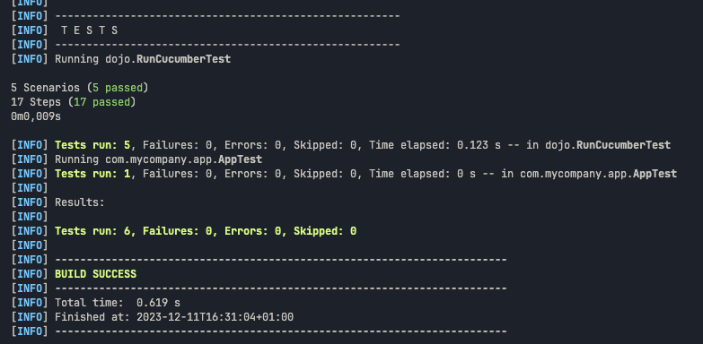

Ce dépôt concerne les rendus de mailto:hugo.monte@etu.univ-tlse2.fr[Hugo Monté].

== TP1

.Code
```java
public class StepDefinitions {
    private String today;
    private String actualAnswer;

    @Given("an example scenario")
    public void an_example_scenario() {
    }

    @When("all step definitions are implemented")
    public void all_step_definitions_are_implemented() {
    }

    @Then("the scenario passes")
    public void the_scenario_passes() {
    }

    @Given("today is {string}")
    public void today_is(String day) {
        this.today = day;
    }

    @When("I ask whether it's Friday yet")
    public void i_ask_whether_it_s_friday_yet() {
        this.actualAnswer = IsItFriday.isItFriday(this.today);
    }

    @Then("I should be told {string}")
    public void i_should_be_told(String string) {
        assertEquals(string, actualAnswer);
    }
}

class IsItFriday {
    static String isItFriday(String today) {
        return "Friday".equals(today) ? "TGIF" : "Nope";
    }
}
```

.Résultat


=== Bonus

.Détection des ouvertures, fonctionne mais améliorable selon le besoin
```js
window.count = 0

document.querySelectorAll("details").forEach(el => el.addEventListener("toggle", () => {
     if (el.hasAttribute("open"))
         window.count++

    console.log(window.count)
}));
```

== TP2


.Code
```java
package dojo;

import java.util.ArrayList;
import java.util.List;

public class Order {
    private String owner;
    private String target;
    private List<String> cocktails = new ArrayList<>();


    public void declareOwner(String name) {
        this.owner = name;
    }

    public void declareTarget(String name) {
        this.target = name;
    }

    public List<String> getCocktails() {
        return this.cocktails;
    }

    public String getOwner() {
        return this.owner;
    }

    public String getTarget() {
        return this.target;
    }
}
```

.Résultat


== TP3


.Code
```gherkin
Feature: Life

    Scenario: The person is sleeping
        Given "Hugo" is "sleeping"
        When I ask whether "Hugo" is "sleeping"
        Then I should be told "Yes"

    Scenario: The person wakes up
        Given "Hugo" is "sleeping"
        When "Hugo" wakes up
        When I ask whether "Hugo" is "sleeping"
        Then I should be told "No"

    Scenario: The person is hungry by default
        Given "Hugo" is "awake"
        When I ask whether "Hugo" is "hungry"
        Then I should be told "Yes"

    Scenario: The person eats
        Given "Hugo" is "awake"
        When "Hugo" eats
        And I ask whether "Hugo" is "hungry"
        Then I should be told "No"

    Scenario: The person cannot brush teeth before eating
        Given "Hugo" is "awake"
        When "Hugo" brushes teeth
        And I ask whether "Hugo" is "clean teeth"
        Then I should be told "Eat first"

    Scenario: The person brushes teeth
        Given "Hugo" is "awake"
        When "Hugo" eats
        And "Hugo" brushes teeth
        And I ask whether "Hugo" is "clean teeth"
        Then I should be told "Yes"

    Scenario: The person is named right
        Given "Hugo" is "awake"
        When I ask their name
        Then I should be told "Hugo"
```

```js
const assert = require('assert')
const { When, Then, Given } = require('@cucumber/cucumber')
const { Person } = require('../../src')

Given('{string} is {string}', function (name, sleeping) {
    this.person = new Person(name, sleeping === 'sleeping')
});

When("{string} wakes up", function(name) {
    this.person.wakeUp()
})

When("{string} eats", function(string) {
    this.person.eat()
})

When("{string} brushes teeth", function(string) {
    try {
        this.person.brushTeeth()
    } catch(e) {
        this.actualAnswer = e.message
    }
})

When("I ask whether {string} is {string}", function (name, stateType) {
    if (stateType === 'sleeping')
        this.actualAnswer = this.person.sleepingState
    else if (stateType === 'hungry')
        this.actualAnswer = this.person.hungerState
    else if (stateType === "clean teeth")
        this.actualAnswer = this.person.teethState
});

When("I ask their name", function() {
    this.actualAnswer = this.person.name
})

Then('I should be told {string}', function (expectedAnswer) {
    assert.equal(this.actualAnswer, expectedAnswer)
});
```

```js
class Person {
    constructor(name, sleeping) {
        this.name = name
        this.sleeping = sleeping
        this.hungry = !sleeping;
        this.brushedTeeth = false;
    }

    get sleepingState() {
        return this.sleeping ? "Yes" : "No"
    }

    get hungerState() {
        return this.hungry ? "Yes" : "No"
    }

    get teethState() {
        if (this.hungry) return "Eat first"

        return this.brushedTeeth ? "Yes" : "No"
    }

    wakeUp() {
        this.sleeping = false
        this.hungry = true
    }

    eat() {
        this.hungry = false
    }

    brushTeeth() {
        if (this.hungry)
            throw new Error("Eat first")
        
        this.brushedTeeth = true
    }
}

module.exports = { Person }
```

.Résultat
image::tp3_result.png[width=80%]

L'objectif était de réaliser une représentation de la vie (simple) au travers de tests, permettant de rendre les étapes d'une journée sous forme d'algorithme.


== TP4

.Code
```java

```

.Résultat


.Résultat

